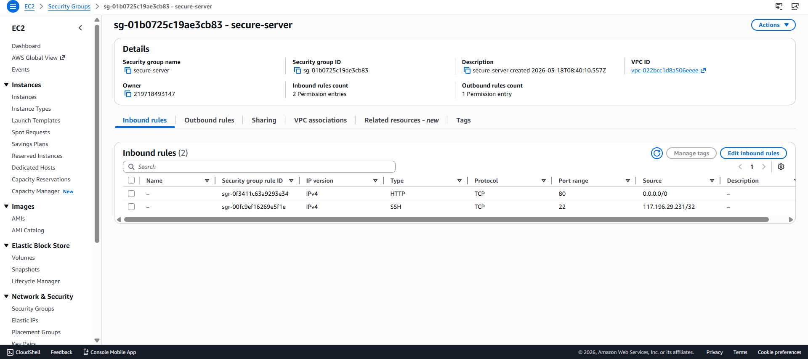
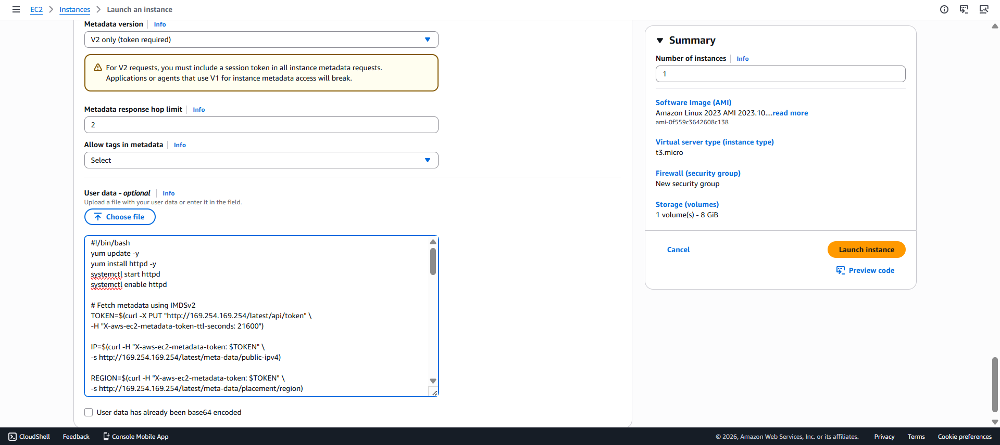
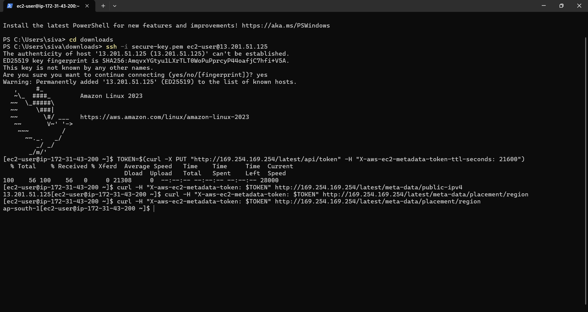
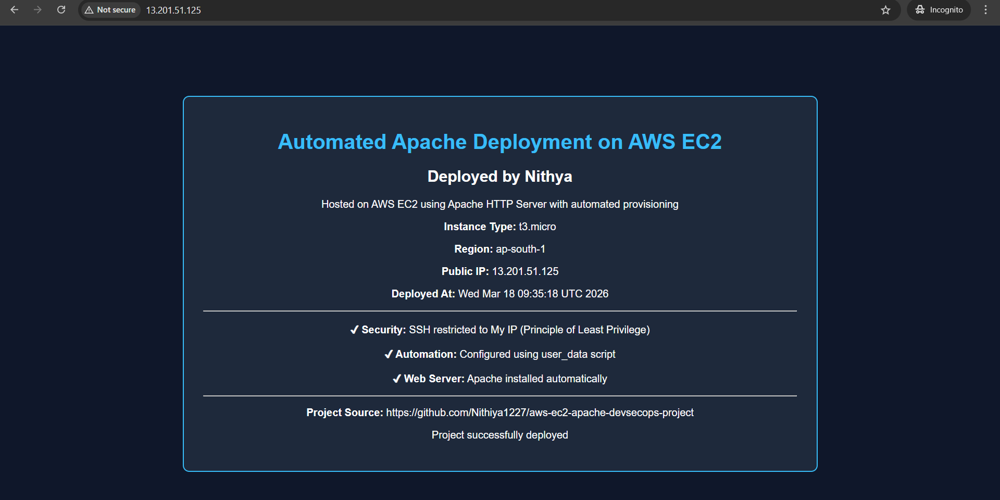

# 🚀 Automated Apache Deployment on AWS EC2 (DevSecOps Mini Project)

## 📌 Project Overview
This project demonstrates automated provisioning and configuration of an Apache web server on AWS EC2 using user_data bootstrapping. The application dynamically displays instance metadata such as Public IP, Region, and Deployment Timestamp.

---

## 🧠 Key Highlights
- Fully automated server setup (no manual intervention)
- Dynamic metadata rendering on web page
- Secure metadata access using IMDSv2
- Real-time deployment information display

---

## ⚙️ Technologies Used
- AWS EC2
- Apache HTTP Server
- Linux (Amazon Linux 2)
- Shell Scripting (Bash)
- EC2 Instance Metadata Service (IMDSv2)

---

## 🔧 Architecture Flow
1. Launch EC2 instance (t3.micro)
2. Execute user_data script at boot time
3. Install and start Apache automatically
4. Fetch metadata securely using IMDSv2
5. Generate dynamic HTML page
6. Access application via Public IP

---

## 🔐 Security Implementation
- SSH access restricted to **My IP only**
- Used **IMDSv2 (token-based authentication)** for metadata
- Follows **Principle of Least Privilege**

---

## 🚀 Automation Details
- Apache installed using `yum`
- Service enabled using `systemctl`
- Metadata retrieved using `curl` with token
- HTML generated dynamically using shell script

---

## 📸 Project Screenshots

### 🖥️ EC2 Instance Details

---

### 🔐 Security Group Configuration

---

### ⚙️ user_data Script

---

### 📡 Metadata Retrieval (IMDSv2)

---

### 🌐 Application Output

---

## 🔗 Access the Application
http://<your-public-ip>

---

## 💡 Key Learning Outcomes
- EC2 provisioning and configuration
- Bootstrapping using user_data
- Secure metadata handling (IMDSv2)
- Basic DevSecOps practices

---

## 📂 Repository Structure
.
├── user_data.sh
├── output.png
└── README.md

---

## 🔄 Future Enhancements
- Infrastructure provisioning using Terraform
- CI/CD integration using Jenkins
- HTTPS setup with Nginx and SSL

---

## 👨‍💻 Author
Nithiya Bharathi 
